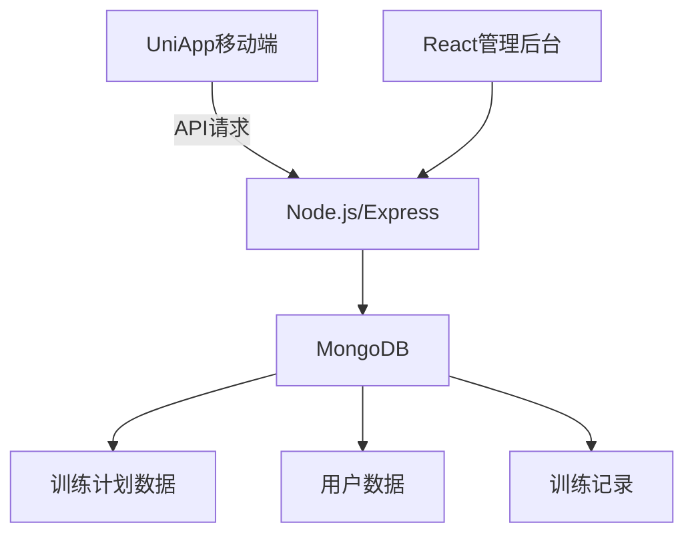
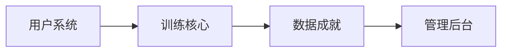

---

# 军旅健身App - 铁炼计划  
**版本**：MVP 1.0  
**技术栈**：  
- 移动端：UniApp（Vue3语法）  
- 后端：Node.js + Express + MongoDB  
- 管理后台：React + Ant Design  

---

## 一、核心功能规划（MVP 必做）

| 模块         | 功能                      | 技术实现                                                               | 优先级 |
| ------------ | ------------------------- | ---------------------------------------------------------------------- | ------ |
| **用户系统** | 手机号注册/登录           | JWT 鉴权 + 阿里云短信 API                                              | ★★★★★  |
|              | 个人资料（昵称/兵种选择） | MongoDB 集合：`users` {\_id, phone, nickname, soldierType, createdAt}  | ★★★☆☆  |
| **训练中心** | 新兵连“三个 100”计划      | 预设计划数据（JSON 结构见附录）                                        | ★★★★★  |
|              | 军体拳基础动作库          | 视频演示（云存储 URL） + 文字步骤                                      | ★★★★☆  |
|              | 跑步/徒步计时器           | UniApp 背景任务 + 实时数据记录                                         | ★★★★☆  |
| **数据记录** | 训练完成打卡              | Express API：`POST /api/training/log`                                  | ★★★★★  |
|              | 周度数据统计              | MongoDB 聚合查询：按周分组统计训练量                                   | ★★★☆☆  |
| **成就系统** | 军事主题勋章              | 成就规则引擎（示例：`{type:"pushup", target:1000, medal:"钢铁战士"}`） | ★★★★☆  |

> ⚠️ **合规要求**：
>
> - 兵种选择仅包含**历史兵种**（如“侦察兵-1980s”），禁用现役部队信息
> - 军体拳教程标注“**民用简化版**”

---

## 二、技术架构设计



### 关键接口定义

1. **训练计划获取**

   ```javascript
   // GET /api/training/plans
   Response: [
     {
       id: "newbie-100",
       title: "新兵连三个100",
       drills: [
         {
           name: "俯卧撑",
           target: 100,
           unit: "次",
           video: "https://oss.com/pushup.mp4",
         },
         { name: "深蹲", target: 100, unit: "次" },
       ],
     },
   ];
   ```

2. **提交训练记录**
   ```javascript
   // POST /api/training/log
   Request Body:
   {
     userId: '60d5ecb8f2b87f3a18e456a3',
     planId: 'newbie-100',
     drill: '俯卧撑',
     completed: 100, // 实际完成数
     duration: 300   // 秒
   }
   ```

---

## 三、数据库设计（MongoDB）

```javascript
// 用户集合
const UserSchema = new Schema({
  phone: { type: String, unique: true }, // 登录账号
  nickname: String,
  soldierType: {
    type: String,
    enum: ["侦察兵-80s", "炮兵-90s", "装甲兵-00s"], // 预设历史兵种
  },
});

// 训练记录集合
const TrainingLogSchema = new Schema({
  userId: { type: Schema.Types.ObjectId, ref: "User" },
  planId: String,
  drill: String,
  completed: Number, // 完成量
  duration: Number, // 耗时(秒)
  date: { type: Date, default: Date.now },
});

// 成就规则集合
const MedalRuleSchema = new Schema({
  medalName: String, // 勋章名称
  condition: {
    // 条件表达式
    type: { enum: ["totalCount", "continuousDays"] },
    target: Number, // 目标值
  },
});
```

---

## 四、关键实现代码片段

### 1. UniApp 训练计时器（前端）

```vue
<template>
  <view>
    <text>{{ formatTime(timer) }}</text>
    <button @tap="startRunning">开始训练</button>
  </view>
</template>

<script setup>
import { ref } from "vue";
const timer = ref(0);
let timerInterval;

const startRunning = () => {
  timerInterval = setInterval(() => {
    timer.value++;
  }, 1000);
};

// 提交记录到后端
const submitLog = async () => {
  await uni.request({
    url: "/api/training/log",
    method: "POST",
    data: { drill: "running", duration: timer.value },
  });
};
</script>
```

### 2. 成就检查服务（Node.js）

```javascript
// utils/medalService.js
exports.checkMedal = async (userId) => {
  const userLogs = await TrainingLog.find({ userId });

  // 规则1：总训练次数达标
  const totalCount = userLogs.length;
  if (totalCount >= 100) {
    await assignMedal(userId, "百日锤炼勋章");
  }

  // 规则2：连续训练7天
  const dates = [...new Set(userLogs.map((log) => log.date.toDateString()))];
  const continuousDays = calculateContinuousDays(dates);
  if (continuousDays >= 7) {
    await assignMedal(userId, "钢铁意志勋章");
  }
};
```

---

## 五、合规安全措施

1. **内容过滤中间件**

   ```javascript
   // middleware/contentFilter.js
   const blockedKeywords = ["现役", "番号", "XX军区"];

   const filterMilitaryContent = (req, res, next) => {
     if (
       req.body.comment &&
       blockedKeywords.some((kw) => req.body.comment.includes(kw))
     ) {
       return res.status(400).json({ error: "包含敏感军事信息" });
     }
     next();
   };
   ```

2. **数据存储规范**
   - 禁止存储用户地理位置
   - 成就名称使用**虚拟勋章**（如“荒野先锋”替代“侦察兵标兵”）

---

## 六、开发里程碑计划

| 阶段       | 周期 | 交付物                           | 验收标准                   |
| ---------- | ---- | -------------------------------- | -------------------------- |
| 核心框架   | 1 周 | UniApp 基础工程+Express 服务框架 | 完成跨端编译/基础 API 测试 |
| 用户系统   | 1 周 | 手机登录+个人资料模块            | 支持短信验证码登录         |
| 训练中心   | 2 周 | 三个 100 计划/军体拳/计时器      | 完成 5 个预设训练项目      |
| 数据与成就 | 1 周 | 训练记录存储+勋章系统            | 成就规则触发准确率 100%    |
| 合规测试   | 3 天 | 安全审查报告                     | 通过法律顾问基础审核       |

> ⏱ **总开发周期**：5.5 周（单人全职开发）

---

## 七、附录：预设训练计划

```json
// training-plans.json
[
  {
    "id": "newbie-100",
    "title": "新兵连基础计划",
    "description": "每日完成3个100次训练",
    "drills": [
      { "name": "俯卧撑", "target": 100, "unit": "次" },
      { "name": "仰卧起坐", "target": 100, "unit": "次" },
      { "name": "深蹲", "target": 100, "unit": "次" }
    ]
  },
  {
    "id": "army-boxing",
    "title": "军体拳入门",
    "drills": [
      { "name": "贯耳冲膝", "video": "https://oss.com/boxing1.mp4" },
      { "name": "抓腕砸肘", "video": "https://oss.com/boxing2.mp4" }
    ]
  }
]
```

此版本可实现**基础训练闭环**，后续迭代可加入社交功能（兵营小组）和电商模块。建议开发顺序：


